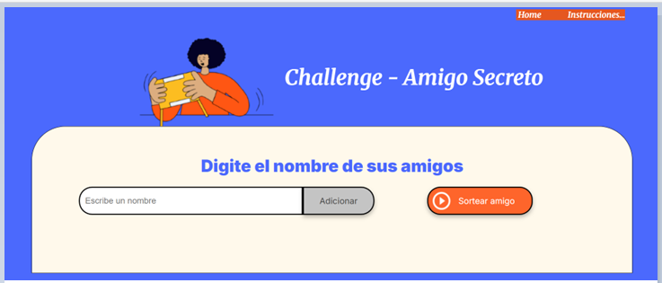
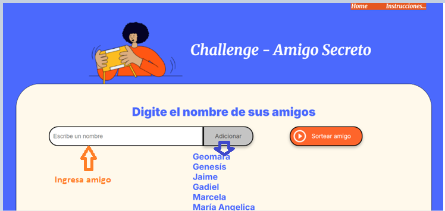
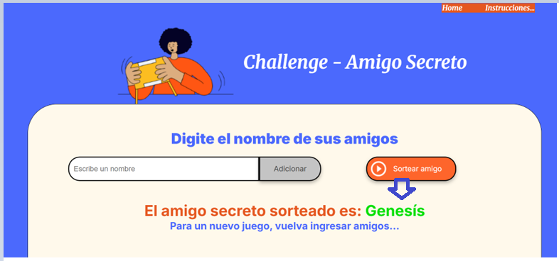
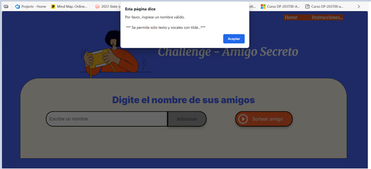
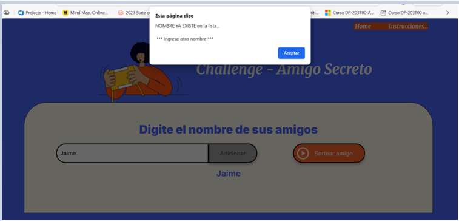
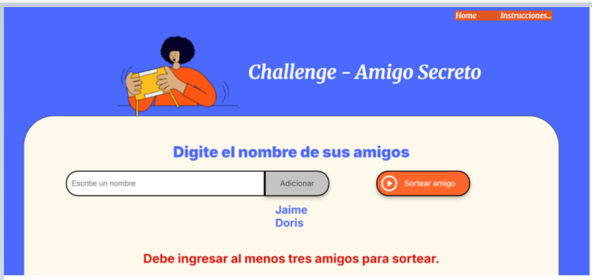
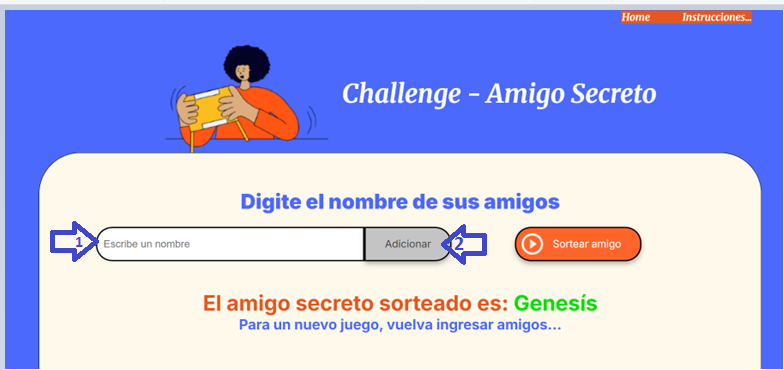

<h1>Challenge - Amigo Secreto (Programa ONE – Grupo 9)</h1>
Autor: Jaime Pradenas Pizarro - Fecha: 15 septiembre de 2025  

<h2>Descripción:</h2>

 Esta aplicación permite a los usuarios ingresar nombres de amigos en una lista para luego realizar un sorteo aleatorio y determinar quién es el "amigo secreto".
El usuario deberá agregar nombres mediante un campo de texto y un botón "Adicionar". Los nombres ingresados se mostrarán en una lista visible en la página, y al finalizar, un botón "Sortear Amigo" seleccionará uno de los nombres de forma aleatoria, mostrando el resultado en pantalla.
 

<h2>Objetivo:</h2>
 
El objetivo de este desafío, es poner en práctica los conceptos adquiridos sobre lógica de programación, teniendo como base los códigos proporcionados en HTML y CSS, JS para implementar y desarrollar el desafío con cubrir con lo requerido y llevar a la práctica los aspectos fundamentales sobre lógica de programación como variables, condicionales, funciones y listas, entre otros.

Este desafío está diseñado para que puedas aplicar de manera práctica los conocimientos adquiridos en los siguientes cursos:  
  •	Lógica de programación: sumérgete en la programación con JavaScript [https://app.aluracursos.com/course/logica-programacion-sumergete-programacion-javascript] 

  •	Lógica de programación: explorar funciones y listas [https://app.aluracursos.com/course/logica-programacion-explorar-funciones-listas] 

  •	Git y GitHub: repositorio, commit y versiones [https://app.aluracursos.com/course/git-github-repositorio-commit-versiones] 

<h2>Funcionalidades:</h2>

Agregar nombres: Los usuarios escribirán el nombre de un amigo en un campo de texto y lo agregarán a una lista visible al hacer clic en "Adicionar".  
  •	Validar entrada: Si el campo de texto está vacío, el programa mostrará una alerta pidiendo un nombre válido. 
  •	Visualizar la lista: Los nombres ingresados aparecerán en una lista debajo del campo de entrada. 
  •	Sorteo aleatorio: Al hacer clic en el botón "Sortear Amigo", se seleccionará aleatoriamente un nombre de la lista y se mostrará en la página. 

<h2>Reglas y Consideraciones adicionales</h2>
 

1.	Registro nombre - No válido: no puede estar vacío, el nombre no debe contener números y caracteres especiales (la aplicación entrega una alerta para ingresar registro valido)
2.	Registro nombre – Válido sólo letras mayúsculas o minúsculas, se pueden registrar nombre con tildé 
3.	Se requiere como límite mínimo, que el usuario registre a lo menos 3 amigos para que tenga sentido el sorteo (la aplicación entrega un mensaje para completar el registro)
4.	No existe un límite máximo de registros de amigos
5.	Al presionar botón “Sortear amigo”, con cantidad de registros y nombre validos,se mostrará mensajes con amigo sorteado en forma aleatoria
6.	Para volver a jugar un nuevo sorteo de amigos una vez realizado el sorteo, el usuario podrá ingresar un grupo de amigos 
7.	Se implementó instrucciones de ajustes de la página para distintos dispositivos móvil, Tablet y distintos navegadores.
8.	Agrega con instrucciones del juego   instrucciones.html

  

________________________________________________________________________________________________________________________

<h2>Intrucciones del Juego Amigo secreto</h2>

En la pagina dat click, en menú superior derecho "instrucciones" para más detalles. 
  
- Ingresa nombre válido y luego presiona el botón "Adicionar" por cada participantes, en caso que escribas un nombre NO VALIDO, la aplicación indicará que el nombre NO es válido. 
- El sistema solo permite realizar el sorteo si hay al menos 3 amigos en la lista. Si intentas sortear con menos de 3, veras un mensaje y podrás seguir agregando participantes. 
- Cuando hayas agregado a todos, presiona el botón "Sortear Amigo". 
- El sistema selecciona de manera aleatoria "Amigo Secreto" sorteado que se despliega en pantanlla. 
- Si queres realizar un nuevo juego, puedes directamente escribir un nuevo nombre en la casilla indicada y presionar el botón "Adicionar" o bien click en menu superior "Home" para iniciar un nuevo juego y sorteo. 

________________________________________________________________________________________________________________________

🎁<h2>Tecnologí­as Utilizadas</h2>

- HTML5      -> Estructura semántica del contenido. 
- CSS3       -> Estilos responsivos y diseño visual. 
- JavaScript -> lógica del sorteo y manejo dinámico del DOM
- Git        -> control de versiones y colaboración

________________________________________________________________________________________________________________________

<h2>Esquema Diagrama de Challenge - amigo secreto:</h2>

<h3>Explicación paso a paso del flujo</h3>
1.	Inicio
  El proceso comienza.

2.	Home – Front página inicial de ingreso 
  Se muestra la interfaz para ingresar un nombre.

3.	¿Input – Escribe nombre VÁLIDO? 
  Se valida si el usuario ingresó algún texto.
  o	No: Se muestra una alerta y se vuelve a la página de ingreso.
  o	Sí: Se continúa y queda disponible para adicionar nombre en la lista.

4.	ADICIONAR nombre en la lista
   Muestra el nombre por pantalla.

5.	¿Ya existe en la lista? (
  Se comprueba si el nombre está duplicado.
  o	Sí: Se muestra una alerta que ya EXISTE en la lista.
  o	No: Se agrega el nombre a la lista.

6.	¿Cantidad de registro nombres en la lista <3? 
  Se valida si hay suficientes participantes.
  o	Sí: Se muestra un mensaje indicando que se necesitan más nombres.
  o	No: Se selecciona un nombre aleatorio.

7.	¿Usuario Sortea amigo secreto, presiona "Sortear Amigo"?
  Se espera que el usuario decida iniciar el sorteo.
  o	No: Se regresa para ingresar otro nombre.
  o	Sí:  Siguiente paso.

8.	Mostrar amigo secreto 
  Se muestra el resultado del sorteo.

9.	¿Usuario desea generar Nuevo juego? 
  Se pregunta si se desea iniciar un nuevo juego.
  o	Sí: Se reinician las variables y se vuelve a la página de ingreso.
  o	No: El proceso finaliza.

_____________________________________________________________________________________________________________________________

<h2>Vista Front - Home:</h2>

 Front: página de INICIO entrada del flujo, con imagen representativa y titulo de Challenge – Amigo Secreto
 

 Front: Página con ingreso de registros de amigos con imagen representativa, título de Challenge – Amigo Secreto y lista de registros válidos.</h3>

 Front: Página con resultado de sorteo de amigo secreto, una vez ingresados los nombres válidos requeridos y dando click botón “Sortear Amigo”, muestra el resultado del amigo secreto asignado en forma aleatoria. (con imagen representativa, título de Challenge – Amigo Secreto y amigo sorteado).</h3>

**** Para un nuevo juego, el usuario deberá escribir nombres de un nuevo grupo de amigos, donde se inicializarán las variables y listas para un nuevo sorteo.
 

 Front: Con mensajes No válidos, despliega alerta mediante una función </h3> 
function mostrarAlertaNombreInvalido() {
   alert("Por favor, ingrese un nombre válido.\n\n *** Se permite sólo texto y vocales con tilde...***");
}
Cuando:
1.	Usuario, hace click en botón “Adicionar”, Sin ingresar nombre de amigo. 
2.	Usuario, hace click en botón “Sortear Amigo”, Sin ingresar nombre de amigo 
3.	Usuario, ingresa nombre de amigo con números o caracteres especiales no permitidos. 

  Front: Con mensajes No válidos, cuando un nuevo registro nombre de amigo, ya existe en la lista. Despliegue alerta mediante una función</h3> 
function mostrarAlertaExisteEnLista() {
   alert("NOMBRE YA EXISTE en la lista...\n\n *** Ingrese otro nombre ***");
}
 

 Front: Con mensajes No válidos, cuando el usuario ha registrado menos de tres nombres de amigos. Despliegue un mensaje por pantalla</h3> 
 

<h2>ESTRUCUTURA DE DESARROLLO Y CODIGOS IMPLEMENTADOS</h2>
challenge-amigo-secreto_esp-main/ │ 
   ├── index.html ├
   ├── instrucciones.html ├
   ├── README.md├
── assets/ │ 
└── amigo-secreto.png
└── frontEntrada.pgn
└── frontFaltanNombres.pgn
└──frontIngreso.pgn
└──frontInstrucciones.pgn
└──frontNombreExiste.pgn
└──frontNombreNoValido.pgn
└──frontNuevo.pgn
└──frontResultado.pgn
└──play_circle_outline.pgn

── styles / │ 
└── style.css
└── style_instrucciones.css

── js/ │
 └── app.js 

_______________________________________________________________________________________________________________________

_______________________________________________________________________________________________________________________

 ## Código HTML – index.html
<!DOCTYPE html>
<html lang="es">
<head>
    <meta charset="UTF-8">
    <meta name="viewport" content="width=device-width, initial-scale=1.0">
    <link rel="stylesheet" href="styles/style.css">
    <link rel="preconnect" href="https://fonts.googleapis.com">
    <link rel="preconnect" href="https://fonts.gstatic.com" crossorigin>
    <link href="https://fonts.googleapis.com/css2?family=Inter:wght@100;400;700;900&family=Merriweather:ital,wght@0,300;0,400;0,700;0,900;1,300;1,400;1,700;1,900&display=swap" rel="stylesheet">
    <title>Challenge - Amigo Secreto - ONE G9</title>
</head>

<body>

    <main class="main-content">
                <header class="header">
            <nav class="header__menu">
                <a class="header__menu__link" href="index.html>Home</a>
                <a class="header__menu__link" href="instrucciones.html">Instrucciones...</a>
            </nav>
        </header>
        <header class="header-banner">
            <h1 class="main-title">Challenge - Amigo Secreto</h1>
            
        </header>
        
        <section class="input-section">
            <h2 class="section-title">Digite el nombre de sus amigos</h2>
            

                <input type="text" id="amigo" class="input-name" placeholder="Escribe un nombre">
                <button class="button-add" onclick="agregarAmigo()">Adicionar</button>
                
                

                <button class="button-draw" onclick="sortearAmigo()" aria-label="Sortear amigo secreto">
                    
                    Sortear amigo
                </button>
                

            

           
            <ul id="listaAmigos" class="name-list" aria-labelledby="listaAmigos" role="list"></ul>
            <ul id="resultado" class="result-sorteo" aria-live="polite"></ul>
            <ul id="resultado2" class="result-requisito" aria-live="polite"></ul>

            

                
            

        </section>
    </main>

    
</body>
</html>

 ## Código JS – app.js
//Desarrollado : Jaime Pradenas Pizarro

//Funciones Reutilización de Alertas
function mostrarAlertaNombreInvalido() {
   alert("Por favor, ingrese un nombre válido.\n\n *** Se permite sólo texto y vocales con tilde...***");
}

function mostrarAlertaExisteEnLista() {
   alert("NOMBRE YA EXISTE en la lista...\n\n *** Ingrese otro nombre ***");
}

//Declación de lista (arreglo)
let amigos = [];

//Implementa una función para agregar amigos
function agregarAmigo() {

    //Capturar el valor del campo de entrada: 
    let input = document.getElementById("amigo");
    
    //Se obtiene el valor del input ingresado y se elimina los espacios en blanco al inicio y al final del registro
    let nombreAmigo = input.value.trim();

    //Se valida el registro ingresado por usuario no haya dejado el campo vacío
    if (nombreAmigo === "") {
        mostrarAlertaNombreInvalido();        
        return; // Salimos de la función sin agregar nada
    }

    //Se valida que le registro "nombreAmigo" contenga sólo letras y se permita vocales con tílde
    let valNombreAmigo = /^[A-Za-zÁÉÍÓÚáéíóúÑñ\s]+$/;

    //Usamos el método test() para verificar el registro almeacenado en variable "nombreAmigo', que permita recibir sólo caracteres permitidos.
    if (!valNombreAmigo.test(nombreAmigo)) {
        mostrarAlertaNombreInvalido(); /*alert("Nombre inválido.!\n\n...Favor, ingrese solo texto, se permite vocales con tilde.");*/
        input.value = "";
        return;
    }
    
// Se valida en registro ingresado por el usuario que NO exista en la lista (array), en caso que exita envía alerta que el registro se encuentra en la lista
    let valExisteNombreAmigo = nombreAmigo.toLowerCase();
    let existe = amigos.some(amigo => amigo.toLowerCase() === valExisteNombreAmigo);
    if (existe) {
        mostrarAlertaExisteEnLista() /*alert("Este nombre de amigo,  ya está en la lista...");*/
        return;
    }

//Añadimos a la lista el nombre de amigo registrado por el usuario en la lista de amigos creada anteriormente.
    amigos.push(nombreAmigo);

//Se limpia el registro del input ingresado por el usuario para recibir nu nuevo nombre de amigo
    input.value = "";

//Invocamos a la fuención para actualizar por pantalla el registro del nombre del amigo
    mostrarListaAmigos();
    resultado.innerHTML = "<li></li>";
}

//Esta función permite desplegar por pantalla el nombre de amigo interactuando con el HTML "listaAmigos"
function mostrarListaAmigos() {
    //Obtenemos el elemento <ul> "listaAmigos", que desplegará el nombre de los amigos en la página
    let lista = document.getElementById("listaAmigos");
    resultado2.innerHTML = "<li></li>";

 // Limpiamos el contenido actual de la lista antes de volver a generarla
    lista.innerHTML = "";

//Se recorre la lista "amigos" generada, creado una nueva línea para cada registro ingresado por le usuario
    amigos.forEach(function(amigo) {
        let li = document.createElement("li"); // Creamos un elemento <li>
        li.textContent = amigo; // Asignamos el nombre del amigo como texto
        lista.appendChild(li); // Agregamos el <li> a la lista <ul>
    });
}

//Está función permite obtener el resultado del "sorteo amigo" de forma aletatoria, aplicando algunas validaciones.
// ej: cuando la lista está vacía o la lista tiene menos de dos registros para sortear
function sortearAmigo() {
    let resultado = document.getElementById("resultado");
    let resultado2 = document.getElementById("resultado2");
    let lista = document.getElementById("listaAmigos");

//En caso que no tenga amigos para agregar y si aprete el boton sortear aparecera este mensaje
    if (amigos.length === 0) {
//resultado.innerHTML = "<li>No hay amigos para sortear</li>";
        mostrarAlertaNombreInvalido();        
        resultado.innerHTML = "<li></li>";
        resultado2.innerHTML = "<li></li>";
        return;
    }

//Se váalida que la liste contenga a lo mensos dos registros para ejecutar el sorteo, de lo contrario envía alerta por pantalla que indica al usuario que debe ingresar al menos dos amigos para sortear
    if (amigos.length < 3) {
        resultado2.innerHTML = "<li>Debe ingresar al menos tres amigos para sortear.</li>";
        return;     
        
    }

//Se elige un elemento indice aleatorios de la lista de amigo ingresada
    let indiceAleatorio = Math.floor(Math.random() * amigos.length);

//Se seleciona el nombreAmigo que fue sorteado aleatoriamente
    let amigoSeleccionado = amigos[indiceAleatorio];

//Despliega por pantalla el amigo selecionado 
    resultado.innerHTML = `
    <h2>Amigo secreto sorteado es: 
        ${amigoSeleccionado}
    </h2>

    <h4 style="color: var(--color-primary);">
        Para un nuevo juego, vuelva ingresar amigos...
    </h4>
    `;

// Limpiar la lista de amigos en pantalla
   lista.innerHTML = "";

// Vaciar el array amigos para que no queden nombres
  amigos = [];
}

___________________________________________________________________________________________________________________

 ##Código CSS – style.css
/* Jaime Pradenas Pizarro : Challenge Amigo Secreto*/
@import url('https://fonts.googleapis.com/css2?family=Krona+One&family=Montserrat:wght@400;600&display=swap');

:root {
    --color-primary: #4B69FD;
    --color-secondary: #FFF9EB;
    --color-tertiary: #C4C4C4;
    --color-button: #fe652b;
    --color-button-hover: #e55720;
    --color-text: #444444;
    --color-white: #FFFFFF;
    --color-menu:  #e55720;
    --color-red: red;
    --color-black: #000000;

    --color-sorteo: #05DF05;
    --fuente-krona: 'Krona One', sans-serif;
    --fuente-montserrat: 'Montserrat', sans-serif;
    --fuente-Merriweather: 'Merriweather', serif;
    
}

.alerta-centrada {
    text-align: center;
    color: var(--color-red);
    font-size: 18px;
    margin-top: 20px;
    font-family: var(--fuente-montserrat);
}

/* Estilos generales */
* {
    margin: 0;
    padding: 0;
    /*box-sizing: border-box;*/
}

body {
    /*height: 100vh;*/
    box-sizing: border-box;
    background-color: var(--color-primary);
    display: flex;
    justify-content: center;
    align-items: center;
}

.header{
    padding: 0% 2% 1% 92%;
}

.header__menu{
    display: flex;
    gap: 50px;
    justify-content: right;
    align-items: center;
    background-color: var(--color-menu);
}
.header__menu__link{
    font-family: var(--fuente-Merriweather);
    font-style: italic;
    font-size: 0.8rem;
    font-weight: 600;
    color: var(--color-white);
    text-decoration: none;
}

.main-content {
    display: flex;
    flex-direction: column;
    height: 90%;
    width: 90%;
}

/* Banner */
.header-banner {
    flex: 50%;
    display: flex;
    flex-direction: row-reverse;
    justify-content: center;
    align-items: center;
    padding: 5px 0 0 0;
    /*padding: -10% -10% -10% -10%;*/
}

/* Sección de entrada */
.header{
    padding: 1% 2% 1% 80%;
}

.header__menu{
    display: flex;
    gap: 50px;
    justify-content: right;
    align-items: center;
    background-color: var(--color-menu);
}
.header__menu__link{
    font-family: var(--fuente-Merriweather);
    /*font-style: italic;*/
    font-size: 1rem;
    font-weight: 600;
    color: var(--color-white);
    text-decoration: none;
}

.input-section {
    flex: 20%;
    background-color: var(--color-secondary);
    border: 1px solid var(--color-black); /* #000;*/
    border-radius: 64px 64px 0 0;
    display: flex;
    flex-direction: column;
    align-items: center;
    padding: 35px;
    width: 93%;
}

/* Títulos */
.main-title {
    font-size: 40px;
    font-family: "Merriweather", serif;
    font-weight: 600;
    font-style: italic;
    color: var(--color-white);    
}

.section-title {
    display: flex;
    font-family: "Inter", serif;
    font-size: 32px;
    font-weight: 800;
    color: var(--color-primary);
    margin: 20px 0px;
    text-align: left;
    justify-content: center;
}

/* Contenedores de entrada y botón */
.input-wrapper {
    display: flex;
    flex-direction: row;
    justify-content: center;
    width: 90%;
    max-width: 1000px;
    margin-top: 0px;
}

.input-wrapper_botton {
    display: flex;
    flex-direction: row;
    justify-content: center;
    width: 90%;
    max-width: 1000px;
    margin-top: 0px;
}

.input-name {
    width: 90%;
    padding: 10px;
    border: 2px solid var(--color-black); /* #000;*/
    border-radius: 25px 0 0 25px;
    font-size: 16px;
}

.button-container {
    width: 300px;
    justify-content: center;
       
}

/* Estilos de entrada de texto */
.input-title {
    flex: 1;
    padding: 10px 15px;
    font-size: 16px;
    border: 2px solid #333;
    border-right: none;
    border-radius: 25px 0 0 25px;
    font-family: "Merriweather", serif;
    box-shadow: 0 4px 8px rgba(0, 0, 0, 0.3);
}

/* Estilos de botón */
button {
    padding: 15px 30px;
    font-family: "Inter", sans-serif;
    font-size: 16px;
    border: 2px solid var(--color-black); /* #000;*/
    border-radius: 25px;
    box-shadow: 0 4px 8px rgba(0, 0, 0, 0.3);
    cursor: pointer;
}

.button-add {
    background-color: var(--color-tertiary);
    color: var(--color-text);
    border-radius: 0 25px 25px 0;
    
}

.button-add:hover {
    background-color: #a1a1a1;
}

/* Listas */
ul {
    list-style-type:none;
    color: var(--color-primary);
    font-family: "Inter", sans-serif;
    font-size: 23px;
    margin: 15px 0;
    font-weight: bold; /* Esto aplica negrita */
}

.result-sorteo {
    margin-top: 15px;
    color: var(--color-menu);
    font-size: 22px;
    font-weight: bold;
    text-align: center;
}

.result-requisito{
    display: flex;
    margin-top: 0px;
    color: #d91309;
    font-size: 26px;
    font-weight: bold;
    text-align: center;
}

/* Botón de sortear título */
.button-draw {
    display: flex;
    flex-direction: row;
    align-items: center;
    width: 50%;
    padding: 0% 0% 0% 2%;
    color: var(--color-white);
    background-color: var(--color-button);
    font-size: 16px;
}

.button-draw img {
    margin-right: 15px;
}

.button-draw:hover {
    background-color: var(--color-button-hover);
}

@media (max-width: 1200px) {
    
    .header{
         padding: 10%;  
    }
    
    .header__menu{
        justify-content: center;
    }

    .header-banner {
        justify-content: center;
    }

    .main-content{
        flex-direction: column-reverse;
        padding: 5%;
    }
    
    .input-section{
    width: auto;
    }
}

______________________________________________________________________________________________________________________

<h3>DESARROLLO ADICIONAL – instrucciones.html</h3>
 Front: Página instrucciones.html, se detalla las instrucciones del juego amigo-secreto.
  
 ##Código HTML – instrucciones.html

<!DOCTYPE html>
<html lang="es">
<head>
  <meta charset="utf-8" />
  <meta name="viewport" content="width=device-width, initial-scale=1.0">
  <link rel="stylesheet" href="styles/style_instrucciones.css">
  <link rel="preconnect" href="https://fonts.googleapis.com">
  <link rel="preconnect" href="https://fonts.gstatic.com" crossorigin>
  <link href="https://fonts.googleapis.com/css2?family=Inter:wght@100;400;700;900&family=Merriweather:ital,wght@0,300;0,400;0,700;0,900;1,300;1,400;1,700;1,900&display=swap" rel="stylesheet">

  <title>Instrucciones | Challenger Amigo Secreto</title>
  <meta name="description" content="Instrucciones simples para usar Challenger Amigo Secreto: agregar nombres, validar, sortear y volver a jugar." />
  
</head>
<body>
  

  
  

    <header class="hero">
      <h1>Instrucciones — Challenger Amigo Secreto</h1>
      
Guía para usar la aplicación: Cómo ingresar nombres, validar, sortear y volver a jugar.

      <a class="btn" href="index.html" aria-label="Volver a la página principal">⬅ Volver a la página principal</a>
    </header>

    <section class="card" aria-labelledby="descripcion">
      <h2 id="descripcion">Descripción</h2>
      
Esta aplicación permite ingresar nombres de amigos en una lista para realizar un sorteo aleatorio y determinar quién es el <strong>amigo secreto</strong>. Los nombres se añaden mediante un campo de texto y el botón <em>“Adicionar”</em>; al finalizar, el botón <em>“Sortear Amigo”</em> elige un nombre al azar y lo muestra en pantalla.

      
Tip Verás la lista de nombres debajo del campo de entrada para revisar lo que llevas agregado.

    </section>

    <section class="card" aria-labelledby="vistas">
      <h2 id="vistas">Vistas del front</h2>
      <ul>
        <li><strong>Página de entrada</strong>: imagen representativa y título “Challenge – Amigo Secreto”.</li>
      
        <li><strong>Página de ingreso</strong>: campo para registrar amigos, imagen, título y <em>lista de registros válidos</em>.</li>
      
        <li><strong>Página de resultado</strong>: tras presionar “Sortear Amigo”, muestra el amigo asignado de forma aleatoria, con imagen y título.</li>
      
      </ul>
    </section>

    <section class="card" aria-labelledby="funcionalidades">
      <h2 id="funcionalidades">Funcionalidades</h2>
      <ul>
        <li><strong>Agregar nombres</strong> con el botón <em>“Adicionar”</em>.</li>
        <li><strong>Validar entrada</strong>: si está vacío o no cumple reglas, se muestra una alerta.</li>
        <li><strong>Visualizar la lista</strong> de nombres ingresados.</li>
        <li><strong>Sorteo aleatorio</strong> del amigo secreto y visualización del resultado.</li>
      </ul>
    </section>

    <section class="card" aria-labelledby="reglas">
      <h2 id="reglas">Reglas y consideraciones</h2>
      <ul>
        <li><strong>Nombre no válido</strong>: no puede estar vacío, ni contener números o caracteres especiales.</li>
        <li><strong>Nombre válido</strong>: sólo letras (mayúsculas/minúsculas); se permiten nombres con tilde.</li>
        <li><strong>Mínimo</strong>: registra al menos <strong>3 amigos</strong> para que tenga sentido el sorteo.</li>
        <li><strong>Máximo</strong>: no existe límite de registros.</li>
        <li>Al presionar <em>“Sortear Amigo”</em> con registros válidos, se muestra el amigo asignado de forma aleatoria.</li>
      </ul>
    </section>

    <section class="card" aria-labelledby="alertas">
      <h2 id="alertas">Alertas y mensajes</h2>

      <h3>Nombre inválido</h3>
      <pre><code class="language-js">function mostrarAlertaNombreInvalido() {
  alert("Por favor, ingrese un nombre válido.\n\n*** Se permite sólo texto y vocales con tilde...***")};
 </code></pre>
      
<strong>Cuándo aparece</strong>:

      <ul>
        <li>Al hacer clic en <em>“Adicionar”</em> sin ingresar nombre.</li>
        <li>Al hacer clic en <em>“Sortear Amigo”</em> sin haber ingresado ningún nombre.</li>
        <li>Al ingresar números o caracteres especiales no permitidos.</li>
      
      </ul>

      <h3>Nombre duplicado</h3>
      <pre><code class="language-js">function mostrarAlertaExisteEnLista() {
  alert("NOMBRE YA EXISTE en la lista...\n\n*** Ingrese otro nombre ***")};
    
</code></pre>

      <h3>Menos de 3 participantes</h3>
      
Si has registrado menos de tres nombres, se despliega un mensaje en pantalla invitando a completar el registro antes del sorteo.

      
    </section>

    <section class="card" aria-labelledby="nuevo-juego">
      <h2 id="nuevo-juego">Nuevo juego</h2>
      
Para un nuevo juego, ingresa nombres de un nuevo grupo de amigos. Las variables y listas se inicializarán nuevamente para realizar otro sorteo.

      
    </section>

    <footer>
      

        <a class="btn" href="#top">⬆ Ir arriba</a>
        &nbsp; • &nbsp;
        <a class="btn" href="index.html">⬅ Volver a la página principal</a>
      

      
© Challenger Amigo Secreto — Instrucciones || Jaime Pradenas Pizarro 

    </footer>
  

</body>
</html>

_______________________________________________________________________________________________________________

 ## Código CSS – style_instrucciones.css
/* Jaime Pradenas Pizarro : Challenge Amigo Secreto*/
@import url('https://fonts.googleapis.com/css2?family=Krona+One&family=Montserrat:wght@400;600&display=swap');

:root{
      --fondo:#FFF9EB; /* crema */
      --texto:#4B69FD; /* azul */
      --texto-suave:#3446b6; /* azul más oscuro para subtítulos */
      --card:#ffffff;
      --borde:rgba(75,105,253,0.25);
      --sombra:0 6px 24px rgba(75,105,253,0.12);
      --ok:#2e7d32; --warn:#b76e00; --err:#b71c1c;
      --accent-1:#ffcc80; --accent-2:#c5cae9; --accent-3:#b3e5fc;
    }

html,body{
    height:100%
}

body {
    margin:0;
    font-family:system-ui,-apple-system,Segoe UI,Roboto,Ubuntu,Cantarell,Noto Sans,Arial;
    line-height:1.6;
    background:var(--fondo);color:var(--texto)
}

.wrap{
    max-width:980px;
    margin:0 auto;
    padding:24px;
    position:relative;
    z-index:1
}

header.hero{
    position:relative;
    border-radius:16px;
    background:linear-gradient(180deg, rgba(75,105,253,.06), rgba(75,105,253,.02));
    padding:28px 24px;
    box-shadow:var(--sombra);overflow:hidden;
}

header.hero h1{
    margin:0 0 8px;
    font-size:clamp(1.6rem,3vw,2.4rem);
}

header.hero p.sub{
    margin:0;color:var(--texto-suave);
}

a.btn{
    display:inline-flex;
    align-items:center;
    gap:8px;margin-top:16px;
    text-decoration:none;
    color:var(--texto);
    background:#ffffffcc;
    border:1px solid var(--borde);
    padding:8px 12px;
    border-radius:10px;
    box-shadow:0 2px 10px rgba(75,105,253,.08);
    font-weight:600;
    transition:transform .08s ease, box-shadow .2s ease;
}

a.btn:hover{
    transform:translateY(-1px);
    box-shadow:0 6px 18px rgba(75,105,253,.12);
}

.card{
    background:var(--card);
    border:1px solid var(--borde);
    border-radius:14px;
    padding:18px;
    box-shadow:var(--sombra);
    margin:18px 0;
}

h2{
    font-size:clamp(1.2rem,2.2vw,1.6rem);
    margin:0 0 8px;
}

h3{font-size:1.05rem;
    margin:14px 0 6px;
}

ul,ol{
    padding-left:1.2rem;
}

li+li{
    margin-top:6px;
}

code,kbd,pre{
    font-family:ui-monospace,SFMono-Regular,Consolas,Monaco,monospace
}

pre{
    background:#ffffff; 
    border:1px solid var(--borde); 
    padding:12px;
    border-radius:10px;
    overflow:auto
}

.badge{display:inline-block;
    font-size:.85rem;
    border-radius:999px;
    padding:2px 8px;
    border:1px solid var(--borde);
    background:#fff;
    color:var(--texto);
}

.nota{
    background:linear-gradient(180deg, rgba(255,204,128,.25), rgba(255,249,235,.5));
    border-left:4px solid var(--texto);
    padding:12px;border-radius:10px;
}

footer{
    margin:32px 0 20px;text-align:center;
    color:var(--texto-suave);font-size:.95rem;
}

.bg-ornaments{
    position:fixed;
    inset:-10vh -10vw auto auto;
    width:120vw;height:120vh;
    z-index:0;pointer-events:none;
    opacity:.45;background:
      radial-gradient(120px 120px at 10% 20%, var(--accent-1), transparent 60%),
      radial-gradient(160px 160px at 85% 15%, var(--accent-2), transparent 60%),
      radial-gradient(180px 180px at 80% 80%, var(--accent-3), transparent 60%),
      radial-gradient(220px 220px at 20% 85%, rgba(75,105,253,.18), transparent 60%);
    filter:blur(20px) saturate(1.05);
}

@media (prefers-contrast: more){
    .bg-ornaments{
        opacity:.25;
        filter:none;
    }
    .card{
        box-shadow:none;
    }
 }

 @media print{
    .bg-ornaments,
    a.btn{
        display:none !important;
    }
    .card{
        box-shadow:none;
    }
    body{
        background:white;
    }
    }

__________________________________________________________________________________________________________________________

Programa ONE | Alura Latam - Grupo 9
__________________________________________________________________________________________________________________________

